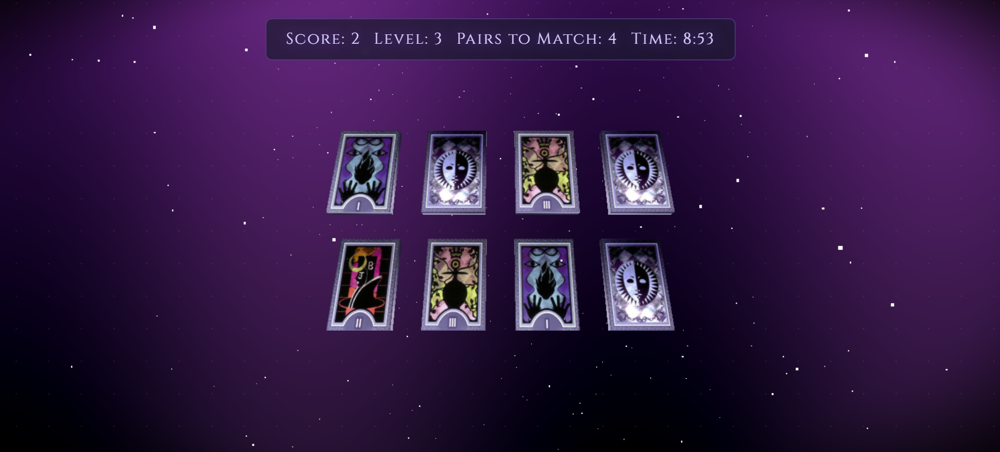

# Description

The Memory Arcana is a 3D memory card-matching game inspired by the aesthetics of tarot cards. Players embark on a mystical journey to test their memory and strategy by matching pairs of cards across progressively challenging levels. With its immersive visuals, captivating sound effects, and dynamic gameplay, the game offers an engaging experience for players of all ages.

# Game Mechanics

## 1. Objective:

Match all pairs of cards in each level before the timer runs out.

## 2. Levels:

- The game starts with 2 pairs of cards in a 2x2 grid.
- Each level adds more pairs, increasing difficulty up to 21 pairs.

## 3. Timer:

- Players have a total of 10 minutes (600 seconds) to complete as many levels as possible.
- When time runs out, the game ends, and the final score is displayed.

## 4. Scoring:

Players earn points based on levels completed and remaining time: Final Score=(Levels Completed×1000)+(Remaining Time×10)Final Score=(Levels Completed×1000)+(Remaining Time×10)

## 5. Sound Effects:

- Flip Sound: Plays when a card is flipped.
- Match Sound: Plays when two cards match.
- Level Complete Sound: Plays upon completing a level.
- Game Complete Sound: Plays when all levels are completed.

## 6. Visual Effects:

- Cards tilt slightly forward for a table-like appearance.
- Subtle animations enhance the mystical ambiance.

# Technologies Used

## 1. Frontend:

- **Three.js**: For rendering 3D scenes, creating card meshes, and managing animations.
- **GSAP**: For smooth animations like card flipping and transitions.
- **HTML/CSS/JavaScript**: For UI elements like menus, overlays, and event handling.

## 2. Audio Integration:

- Custom sound effects (flipcard.mp3, match.wav, level-complete.wav, game-complete.mp3) enhance immersion.

## 3. Build Tool:

**Vite**: Used for fast development and optimized production builds.

## 4. Deployment:

Deployed using **AWS Amplify** for quick and seamless deployment.

# How to Play

1. Visit the [Memory Arcana](https://main.d2p1yzrq3i4ltv.amplifyapp.com/) website.

2. Click on the "Start Game" button to begin.

3. Click on any card to flip it and reveal the symbol.

4. Click on another card to find its matching pair.

5. Match all pairs to complete the level and advance to the next one.

6. Complete as many levels as possible before the timer runs out.

7. Enjoy the immersive visuals and sound effects throughout the game.

# Future Enhancements

## Authentication & Leaderboard

- Use Amazon Cognito for user authentication (login/signup).
- Integrate a leaderboard using AWS AppSync and DynamoDB to store high scores globally.

## Multiplayer Mode

Implement real-time multiplayer using AWS AppSync to allow players to compete against each other.
